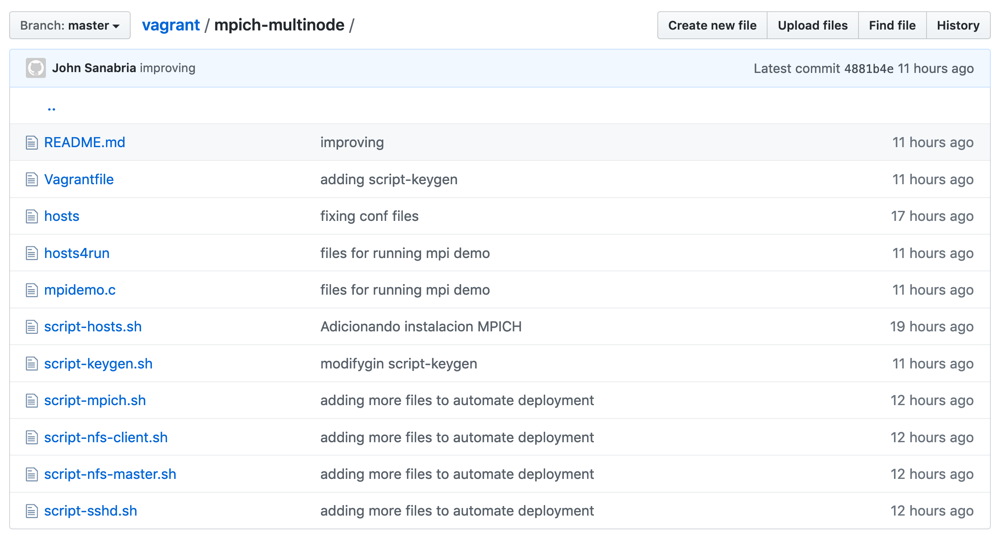

# MPICH Multi-nodo

**Asegúrese de descargar todos los archivos que se encuentran en este directorio.**


---
Ubíquese en el directorio donde descargó los archivos anteriormente indicados para crear tres máquinas con MPICH desplegado en ellas.
Ubicado en el directorio ejecutar el comando:

```
vagrant up
```

Finalmente debe ejecutar los siguientes dos pasos en el nodo maestro, `vagrant ssh master`

* [Acceso passwordless](#acceso-passwordless)
* [Probando MPI Cluster](#probando-mpi-cluster)

## Acceso passwordless

Copiar la llave pública a los nodos de procesamiento

```
ssh-copy-id -i ~/.ssh/id_rsa.pub vagrant@node-mpi-1 # type 'vagrant' as passwd
ssh-copy-id -i ~/.ssh/id_rsa.pub vagrant@node-mpi-2 # type 'vagrant' as passwd
```

## Probando MPI Cluster

Estando dentro de la máquina `master` vaya al directorio `/vagrant`. Asuma el programa `mpidemo.c` es como sigue:

```
#include <stdio.h>
#include <unistd.h>
#include <limits.h>
#include "mpi.h"

int main(){
 
  char hostname[HOST_NAME_MAX + 1];
  gethostname(hostname, HOST_NAME_MAX + 1);
  MPI_Init(NULL, NULL);  
 
  printf("Wonderful Class from host %s!\n",hostname);
 
  MPI_Finalize();

  return(0);
}
```

Compile el programa:

```
mpicc mpidemo.c -o /shared/mpidemo
```

Asuma que usted tiene un archivo llamado `hosts4run` en el directorio donde va a ejecutar este programa con el siguiente contenido:

```
node-mpi-1
node-mpi-2
```

Para ejecutar su programa debe ejecutar la siguiente línea:

```
mpirun -n 4 -f hosts4run /shared/mpidemo
```

---

Para mas detalles de la configuración de NFS y habilitar el accesso *passworless* visitar [este documento](https://docs.google.com/document/d/1IgQXv81USdHU4lRUsbXPN017BAPUXdqi5t9BUa6yXF8/edit?usp=sharing).

---

El levantar las tres máquinas virtuales duró alrededor de **40 minutos** en una máquina con la siguiente configuración:

* Intel Core i7
* 16 GB en RAM

Software

* Vagrant - 2.2.6
* VirtualBox - 6.0.14
